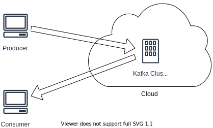
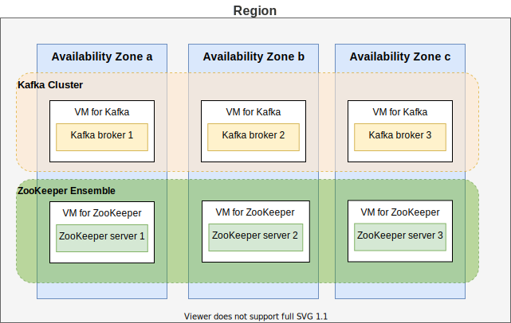

# Benchmark Design

> In essence, **benchmark design leads to a comprehensive specification** whereas benchmark implementation [...] leads to an executable program. -- Bermbach et. al

## Motivation

We want to benchmark the consistency behaviors (_yield_ and _harvest_) of Apache Kafka in the cloud, and find out what parameters could affect the consistency behaviors.

## Benchmark System Setup

### Design

### Open Questions

1. Can we ignore the geographical distance between producer/consumer and Kafka cluster? \
   I assume the distance has not much to do with yield or harvest. Although longer distance may lead to a higher probability of packet loss. But should it count for a SUT's property?

## Kafka Cluster Setup

### Design

### Context

- We want to benchmark the consistency behavior of Kafka in the cloud (GCP).
- We need a realistic production-ready setup for the results to be meaningful.
- We have limited resources to deploy the system:
  - one person beginner knowledge in Kafka and GCP
  - 50 GCP credits
  - <= 30 hours working time

### Decisions

- **1 Kafka cluster per region**

  It is recommended to not distribute one cluster across multiple regions, otherwise the latency may be too high.

- **Use a single region on GCP**

  We decide to start with a single region with a single cluster. Using multiple regions may provide a lower latency for users near the region, but it is also more costly. We may also don't have the time to set up mirroring services across different regions.

- **3 Kafka brokers per cluster, deployed in different zones**

  It is common to have `replication-factor` set to `2` or `3` in Kafka considering availability and latency. We chose `3` as it is the default value. \
  We deploy brokers on separate machines in different availability zones to achieve maximal fault tolerance.

- **3 ZooKeeper servers per ensemble, deployed in different zones**

  [ZooKeeper Administrator's Guide](https://zookeeper.apache.org/doc/r3.1.2/zookeeperAdmin.html#sc_designing) recommends to use 3 servers deployed on different hosts as the minimal setup for fault tolerance.

- **Deploy Kafka broker and ZooKeeper server on different hosts**

  As recommended by Kafka's [official documentation](https://kafka.apache.org/28/documentation.html#zkops).
