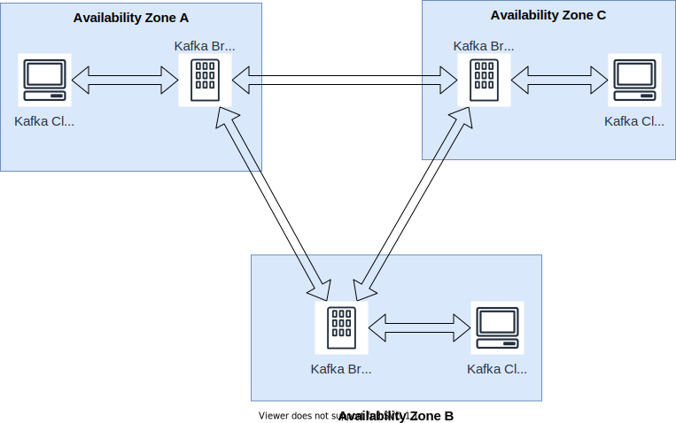

# Benchmark Design

> In essence, **benchmark design leads to a comprehensive specification** whereas benchmark implementation [...] leads to an executable program. -- Bermbach et. al

## Motivation

We want to benchmark the consistency behaviors (_yield_ and _harvest_) of Apache Kafka in the cloud, and find out what parameters could affect the consistency behaviors.

Load producers/generators don't need to be included into the measurement. (don't stress stress generators) They only increase the stress.

- e2e latency
- out of order
  - 50 msgs/5ms (stress)

Kafka: how many partitions?

## Benchmark System Setup

### Design

## Kafka Cluster Setup

### Design

### Context

- We want to benchmark the consistency behavior of Kafka in the cloud (GCP).
- We need a realistic production-ready setup for the results to be meaningful.
- We have limited resources to deploy the system:
  - one person with beginner knowledge in Kafka and GCP
  - 50 GCP credits
  - <= 30 hours working time

### Decisions

- **1 Kafka cluster per region**

  It is recommended to not distribute one cluster across multiple regions, otherwise the latency may be too high.

- **Use a single region on GCP**

  We decide to start with a single region with a single cluster. Using multiple regions may provide a lower latency for users near the region, but it is also more costly. We may also don't have the time to set up mirroring services across different regions.

- **3 Kafka brokers per cluster, deployed in different zones**

  It is common to have `replication-factor` set to `2` or `3` in Kafka considering availability and latency. We chose `3` as it is the default value. \
  We deploy brokers on separate machines in different availability zones to achieve maximal fault tolerance.

- **3 ZooKeeper servers per ensemble, deployed in different zones**

  [ZooKeeper Administrator's Guide](https://zookeeper.apache.org/doc/r3.1.2/zookeeperAdmin.html#sc_designing) recommends to use 3 servers deployed on different hosts as the minimal setup for fault tolerance.

- **Deploy Kafka broker and ZooKeeper server on different hosts**

  As recommended by Kafka's [official documentation](https://kafka.apache.org/28/documentation.html#zkops).

- **Put 1 consumer/Kafka Broker**

  See behavior difference between different Brokers (in different regions).

### Metrics

| Metric      | Definition                                                                           | Description                                                                                           |
| ----------- | ------------------------------------------------------------------------------------ | ----------------------------------------------------------------------------------------------------- |
| Yield       | `Yield = total success responses producer received / total requests producer sent`   | How many requests return a valid response?                                                            |
| Harvest     | `Harvest = number of requests the consumer received / total requests producer sent`  | How many messages are received with a receive request?                                                |
| Order       | `total position offsets of each received message`                                    | To which degree are messages out-of-order?                                                            |
| Duplication | `number of duplicate messages consumer received`                                     | How often are duplicate messages received?                                                            |
| E2e latency | Time elapsed from a message is sent from a producer to it is received by a consumer. | How long does it take for a message to traverse from the producer through the system to the consumer? |

How to measure

- Yield
  - producer sends `p` messages
  - producer receives `r` success responses
  - `yield = r/p`
- Harvest
  - consumer receives `c` _dinstinct_ messages
  - `harvest = c/p`
- Order
  - total position offsets of each received message
- Duplication
  - `duplicates(c) / c`
- E2e Latency
  - producer sends a message at `t1`
  - consumer receives a message at `t2`
  - `t2 - t1`
- Producer latency
  - because `acks` doesn't affect the e2e latency

### Parameters

- P1 (`acks`): The number of acknowledgments the producer requires the leader to have received before considering a request complete.
  - Possibe values: `{0, 1, all}`
  - Default: `all`
- P2 (`enable.idempotence`): When set to `true`, the producer will ensure that exactly one copy of each message is written in the stream.
  - Possible values: `{true, false}`
  - Default: `true`
  - Prerequisite of `true`:
    - `max.in.flight.requests.per.connection` <= 5 (default 5)
    -
- P3

#### Producer Parameters

| Parameter            | Possible value  |
| -------------------- | --------------- |
| `acks`               |                 |
| `enable.idempotence` | `{true, false}` |

#### Broker Parameters

| Parameter                    | Possible value                           |
| ---------------------------- | ---------------------------------------- |
| `min.insync.replicas`        | only changes the results when `acks=all` |
| `default.replication.factor` | 3 (default value)                        |

### Steps

### When to test

- Repeated at different times of day, different days during the week. (CSB Book page 43)

### Workloads

- [ ] Decide to use synthetic or trace-based during implementation
